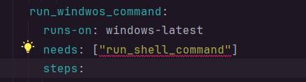
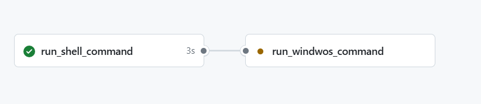

# 第一个工作流

## 准备
建立仓库后，下载到本地，建立.github/workflows目录，然后在目录下新建一个文件，文件名以.yml结尾，比如first.yml。

## 配置文件
```yaml
name: Shell Command
on:
  [push]
jobs:
  run_shell_command:
    runs-on: ubuntu-latest
    steps:
      - name: echo a string
        run: echo "Hello, World! github actions"
      - name: multi-line shell command
        run: |
          node -v
          npm -v
```

## 运行
通过git push提交代码，触发工作流，查看Actions，可以看到工作流运行的结果。

## debug 模式
ACTIONS_STEP_DEBUG = true
ACTION_RUNNER_DEBUG = true

## needs


