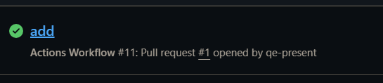
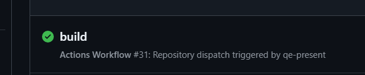

# 文档
[文档地址](https://docs.github.com/zh/actions/writing-workflows/choosing-when-your-workflow-runs/events-that-trigger-workflows)
# on
- 1 push # 默认
- 2 pull_request # pr
- 3 schedule # 定时
- 4 repository_dispatch # 仓库事件
- 5 workflow_dispatch # 手动触发


## pull_request
- closed
- assigned
- open
- reopen


## schedule
- cron
- minutes hours days  months weeks  [参考](https://crontab.guru/#*_*_*_*_*)
### 示例
1 * * * * 每小时的第一分钟  <br>
1,2 * * * * 每小时的第一分钟和第二分钟 <br>
*/5 * * * * 每5分钟 <br>
0 0 * * * 每天的0点<br>
0 0 * * 0 每周日的0点<br>
0 0 1 * * 每月1号的0点<br>
0 0 1 1 * 每年1月1号的0点<br>
## repository_dispatch
- type
- client_payload

### url
https://api.github.com/repos/<owner>/<repo>/dispatches
### 示例
```json
{
  "event_type": "my_event_type",
  "client_payload": {
    "key1": "value1",
    "key2": "value2"
  }
}
```
### Headers
- Content-Type: application/json
- Basic Auth: username:token
## workflow_dispatch
### 例子
```yaml
inputs:
   who-to-greet:
   description: Who to greet in the log
   required: true
   default: 'World'
   type: string
```