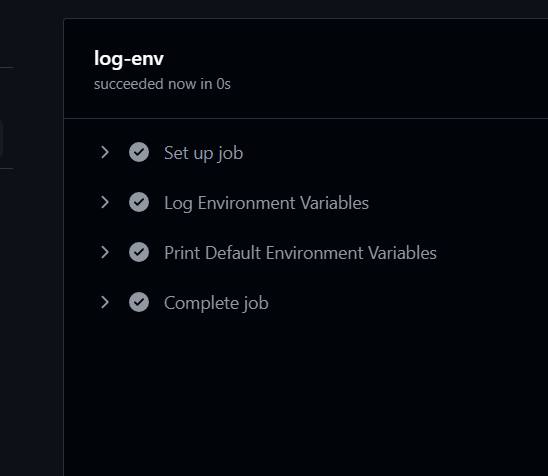

```yaml
name: Env Variables
on:
  [push]
env:
  MY_NAME: "GitHub Actions" # MY_NAME: "GitHub Actions"：这是一个全局环境变量，它可以在整个工作流程中使用。
jobs:
  log-env:
    runs-on: ubuntu-latest
    env:
      job_env: "Job Environment Variable" # job_env: "Job Environment Variable"：这是一个作业级别的环境变量，它可以在整个作业中使用。
    steps:
      - name: Log Environment Variables
        env:
          step_env: "Step Environment Variable" # env: step_env: "Step Environment Variable"：这是一个步骤级别的环境变量，它可以在整个步骤中使用。
        run: |
          echo "Hello, $MY_NAME"
          echo "Hello, ${{ env.job_env }}"
          echo "Hello, ${{ env.step_env }}"
      - name: Print Default Environment Variables
        run: |
          # 打印所有环境变量及其值
          env | sort
```

[参考文档](https://docs.github.com/zh/actions/writing-workflows/choosing-what-your-workflow-does/store-information-in-variables#default-environment-variables)