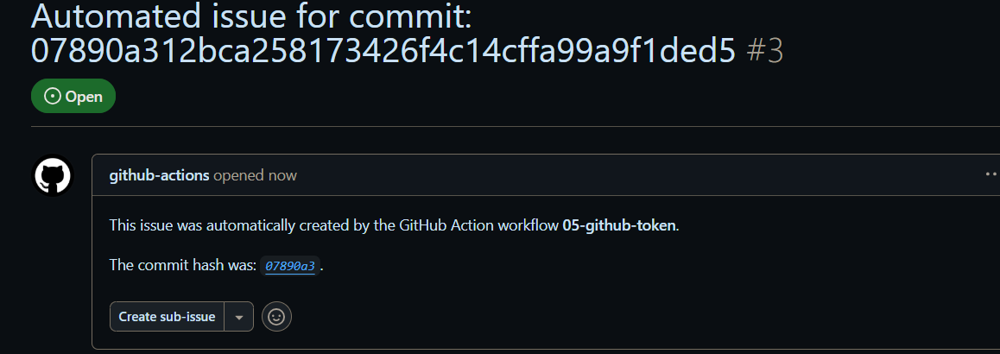

##  GITHUB_TOKEN
GitHub Actions provides a special token called `GITHUB_TOKEN
# 例子--创建issue
```yaml
create_issue:
    runs-on: ubuntu-latest
    permissions:
      issues: write
    steps:
      - name: Create issue using REST API
        run: |
          curl --request POST \
          --url https://api.github.com/repos/${{ github.repository }}/issues \
          --header 'authorization: Bearer ${{ secrets.GITHUB_TOKEN }}' \
          --header 'content-type: application/json' \
          --data '{
            "title": "Automated issue for commit: ${{ github.sha }}",
            "body": "This issue was automatically created by the GitHub Action workflow **${{ github.workflow }}**. \n\n The commit hash was: _${{ github.sha }}_."
            }' \
          --fail
```
## 结果

# 例子--推送一个随机文件
```yaml
push_random_file:
    runs-on: ubuntu-latest
    permissions:
      contents: write
    steps:
      - name: Create a random file
        run: |
          echo "This is a random file with a timestamp: $(date)" > random_file.txt
      - name: Commit and push the random file
        run: |
          git config --global user.name 'github-actions'
          git config --global user.email '
```
# [上一页 04-encrypting-environment-variable](../04-encrypting-environment-variable/04.md)
# [下一页 06-encrypt-decrypt](../06-encrypt-decrypt/06.md)
