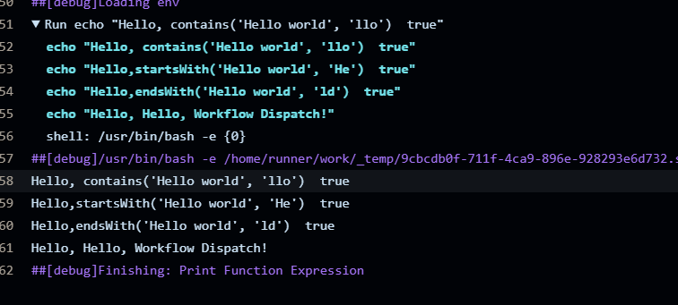

# 函数表达式
[参考文档](https://docs.github.com/zh/actions/writing-workflows/choosing-what-your-workflow-does/evaluate-expressions-in-workflows-and-actions)
# 测试
```yaml
name: 08-function-expression
on:
  workflow_dispatch:
    inputs:
      who-to-greet:
        description: 运行08
        required: true
        default: true
        type: boolean
jobs:
  function:
    runs-on: ubuntu-latest
    steps:
      - name: Print Function Expression
        run: |
          echo "Hello, contains('Hello world', 'llo')  ${{ contains('Hello world', 'llo') }}"
          echo "Hello,startsWith('Hello world', 'He')  ${{ startsWith('Hello world', 'He') }}"
          echo "Hello,endsWith('Hello world', 'ld')  ${{ endsWith('Hello world', 'ld') }}"
          echo "Hello, ${{ format('Hello, {0}!', 'Workflow Dispatch') }}"
```
# 结果

# [上一页 07-context](../07-context/07.md)
# [下一页 09-if-check-function](../09-if-check-function/09.md)
