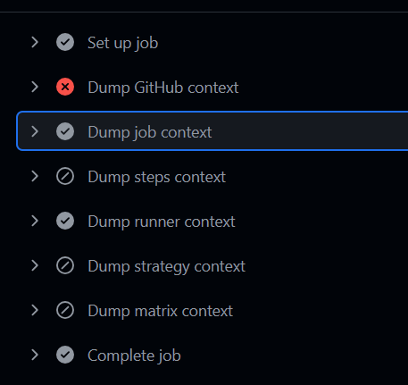

# if 和 检查函数
## if使用
```yaml
if: github.event.inputs.who-to-greet == 'true' # 如果输入的值为true
```
## 检查函数
- failure:失败时执行
- always: 使步骤始终执行，无论前面的步骤是否成功或失败。
- cancelled:函数用于检查工作流是否被取消。如果工作流被取消，则返回 true
- success:当前面的所有步骤都成功时返回
# 结果
- 


# [上一页 08-function-expression](../08-function-expression/08.md)]
# [下一页 10-use-node](../10-use-node/10.md)