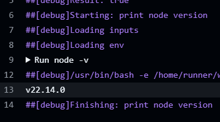

# 使用action/setup-node
```yaml
name: 10-use-node
on:
  workflow_dispatch:
    inputs:
      who-to-greet:
        description: 运行10
        required: true
        default: true
        type: boolean
jobs:
  use-node:
    runs-on: ubuntu-latest
    steps:
      - name: print node version
        run: node -v
      - name: use node action
        uses: actions/setup-node@v4
        with:
          node-version: '22'
      - name: print node version
        run: node -v
```
# 结果
