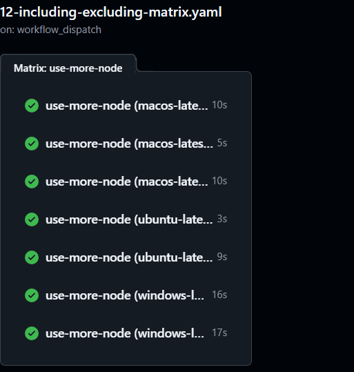

# 包括与排除
```yaml
name: 12-including-excluding-matrix
on:
  workflow_dispatch:
    inputs:
    who-to-greet:
      description: 运行11
      required: true
      default: true
      type: boolean
jobs:
  use-more-node:
    strategy:
      fail-fast: false  # 不要立即停止所有任务
      matrix:
        os: [ubuntu-latest, windows-latest, macos-latest]
        node-version: [21, 22, 23]
        include:
          - os: macos-latest
            node-version: 21
            is_ macos_21: "true"
        exclude:
          - os: ubuntu-latest
            node-version: 21
          - os: windows-latest
            node-version: 22
    runs-on: ${{ matrix.os }}
    env:
      IS_MACOS_21: ${{ matrix.is_macos_21 }}
    steps:
      - name: print node version
        run: node -v
      - name: use node action
        uses: actions/setup-node@v4
        with:
          node-version: ${{ matrix.node-version }}
      - name: print node version
        run: |
          node -v
          echo "IS_MACOS_21: $IS_MACOS_21"

```
# 结果

# [上一页 11-use-strategy](../11-use-strategy/11-md)