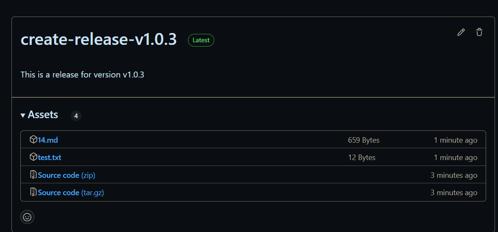

# 发布release
```yaml
name: 14-create-release
on:
  push:
    tags:
      - "v*.*.*"
jobs:
  create-release:
    runs-on: ubuntu-latest
    steps:
      - name: Checkout
        uses: actions/checkout@v4
      - name: Release
        uses: softprops/action-gh-release@v2
        if: startsWith(github.ref, 'refs/tags/')
        env:
          GITHUB_TOKEN: ${{ secrets.GITHUB_TOKEN }}
        with:
          name: create-release-${{ github.ref_name }}
          tag_name: create-release
          body: This is a release for version ${{ github.ref_name }}
          files: 14-create-release/*
```
# 触发
```shell
git tag v1.0.0
git push origin v1.0.0
```
# 结果


# [上一页 13-use-docker](../13-use-docker/13.md)
